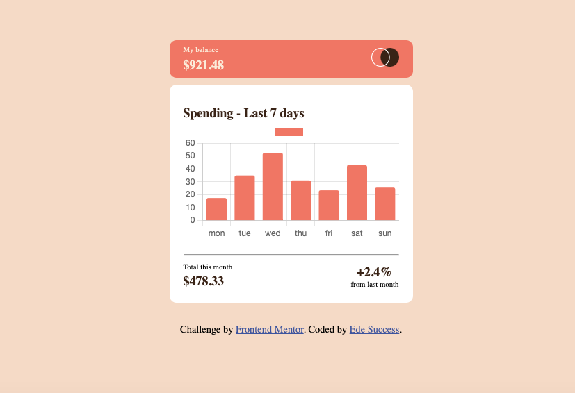

# Frontend Mentor - Expenses chart component solution

## Table of contents

- [Overview](#overview)
  - [The challenge](#the-challenge)
  - [Screenshot](#screenshot)
  - [Links](#links)
- [My process](#my-process)
  - [Built with](#built-with)
  - [What I learned](#what-i-learned)
  - [Continued development](#continued-development)
  - [Useful resources](#useful-resources)
- [Author](#author)

## Overview

### Screenshot

### Links

- Solution URL: https://github.com/edesuccess54/expenses-chart
- Live Site URL: https://expenseschart1.netlify.app

## My process

### Built with

- Semantic HTML5 markup
- CSS custom properties
- Flexbox
- Mobile-first workflow
- Javascript
- https://www.chartjs.org - JS Chart Library

### What I learned

i learnt how to successfully make request to server or local json file using the fetch api, async and await. i also learnt how to manipulate javascript chart library using the json data

### Continued development

i want to keep focusing more on css layout with flex box and Grid, i also want keep focusing on how to implement everything i have learnt in javascript.

### Useful resources

- https://www.chartjs.org - this helps to be able to display the chart

## Author

- Website - https://expenseschart1.netlify.app/
- Frontend Mentor - https://www.frontendmentor.io/profile/edesuccess54
- Twitter - https://twitter.com/mansucsex

## My Challenges

- i was not able to make the bar of the current day have a different color
- i was not able to add the Dollar sign on each price
- i need help on how to display the chart correctly without the horizontal and vertical lines
- i was not able View the bar chart and hover over the individual bars to see the correct amounts for each day

